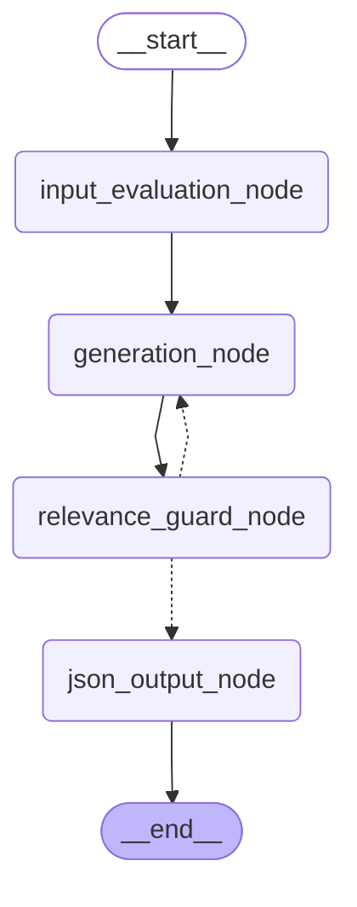

```mermaid
---
config:
  flowchart:
    curve: linear
---
graph TD;
	__start__([<p>__start__</p>]):::first
	input_evaluation_node(input_evaluation_node)
	generation_node(generation_node)
	relevance_guard_node(relevance_guard_node)
	json_output_node(json_output_node)
	__end__([<p>__end__</p>]):::last
	__start__ --> input_evaluation_node;
	generation_node --> relevance_guard_node;
	input_evaluation_node --> generation_node;
	relevance_guard_node -.-> generation_node;
	relevance_guard_node -.-> json_output_node;
	json_output_node --> __end__;
	classDef default fill:#f2f0ff,line-height:1.2
	classDef first fill-opacity:0
	classDef last fill:#bfb6fc

```
